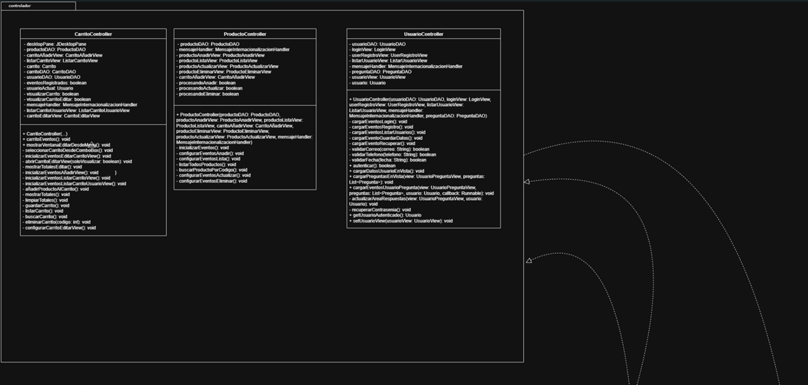
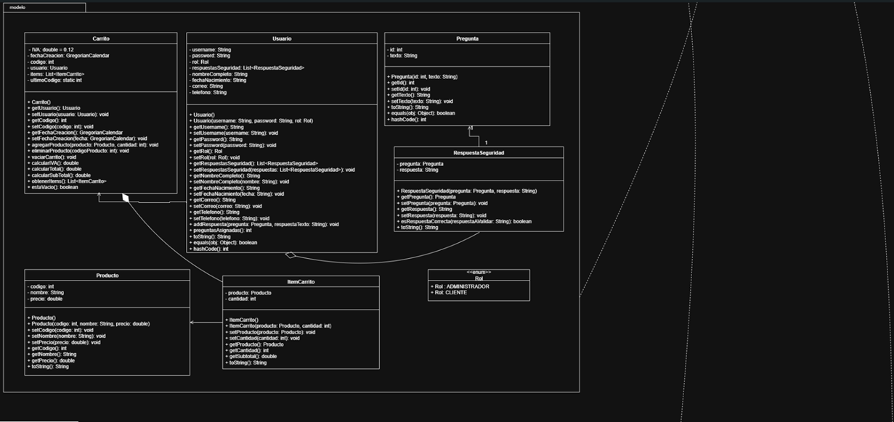
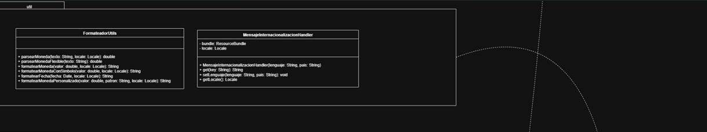
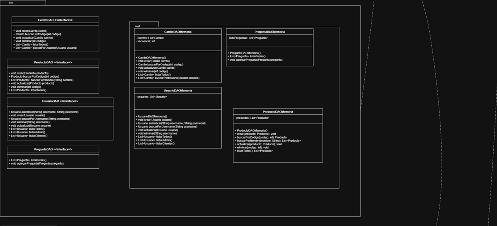
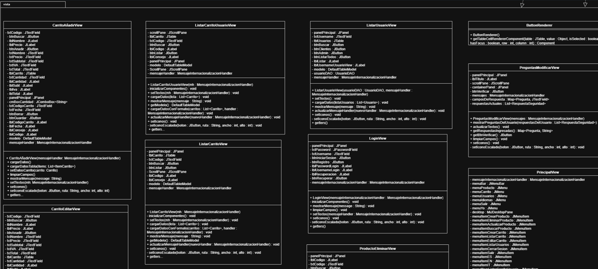
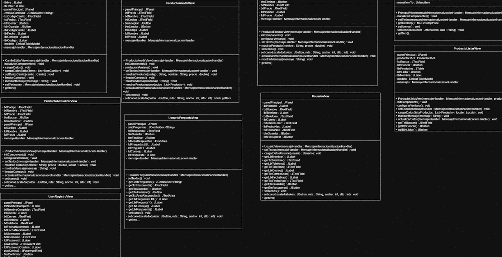
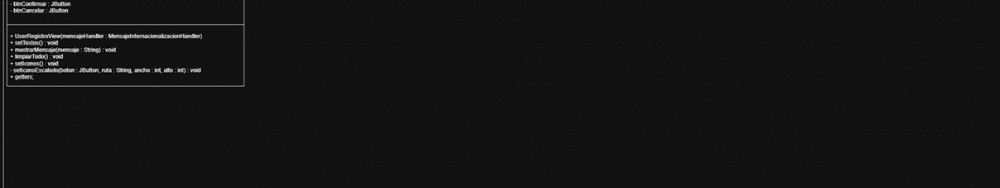

# Práctica de Laboratorio 01: Diseño y Desarrollo de una Aplicación Orientada a Objetos en Java









---

## 📋 Información General

- **Título:** Práctica de Laboratorio 01: Diseño y desarrollo de una aplicación orientada a objetos utilizando Java
- **Carrera:** Computación
- **Asignatura:** Programación Orientada a Objetos
- **Estudiantes:** Mateo Eduardo Molina Chamba
- **Profesor:** Ing. Gabriel León
- **Fecha:** 7-07-2025
- **Repositorio GitHub:** [CarritoDeCompra](https://github.com/EMCMateo/CarritoDeCompra.git)

---

## 🎯 Objetivos de la Práctica

- Aplicar el patrón MVC en el diseño de sistemas con interfaces gráficas.
- Implementar el patrón DAO para desacoplar la lógica de acceso a datos.
- Aplicar principios SOLID en el diseño orientado a objetos.
- Construir interfaces gráficas avanzadas usando Java Swing (JDesktopPane, JInternalFrame, JTable, JComboBox, JMenu, JOptionPane).
- Implementar internacionalización mediante ResourceBundle.
- Formatear datos numéricos y fechas según configuración regional.

---

## 📝 Descripción del Sistema

**Sistema de Gestión de Compras ERP**

El sistema desarrollado permite:

- Registrar proveedores, empleados y productos (artículos, paquetes y servicios).
- Gestionar solicitudes de compra con estados: Solicitada, En Revisión, Aprobada o Rechazada.
- Calcular costos totales de las solicitudes basados en los productos registrados.
- Administrar carritos de compras para usuarios, con control de roles:
  - Usuarios solo ven sus propios carritos.
  - Administradores pueden gestionar todos los carritos.
- Ejecutar operaciones CRUD para usuarios y productos.
- Validar exhaustivamente los datos ingresados, evitando duplicados e inconsistencias.
- Soportar múltiples idiomas (Español, Inglés, Italiano), adaptando textos, formatos monetarios y fechas.

**Características destacadas:**

- Arquitectura limpia basada en MVC-DAO.
- Personalización visual avanzada (íconos, gráficos).
- Sistema completamente internacionalizado (i18n).
- Uso de componentes avanzados de Swing (JTable, JComboBox, JMenu, JOptionPane).
- Control de acceso y permisos según rol (cliente o administrador).

---

## 🏗️ Arquitectura

### Modelo

- Usuario
- Producto
- Carrito
- Pregunta de seguridad

### DAO

- Interfaces:
  - `ProductoDAO`
  - `UsuarioDAO`
  - `CarritoDAO`
  - `PreguntaDAO`
- Implementaciones en memoria

### Controladores

- Gestionan la lógica del sistema, validaciones y control de sesión.
- Incorporan internacionalización de mensajes mediante `MensajeInternacionalizacionHandler`.

### Vistas

- Formularios construidos con `JInternalFrame` gestionados dentro de un `JDesktopPane` (MDI).

---

## ⚙️ Principios SOLID Aplicados

- **SRP (Responsabilidad Única):** Cada clase tiene una única responsabilidad (por ejemplo, `ProductoController` gestiona solo la lógica de productos).
- **OCP (Abierto/Cerrado):** El diseño permite la extensión sin modificar el código existente.
- **DIP (Inversión de Dependencias):** Los controladores dependen de interfaces DAO, facilitando cambios futuros en la tecnología de persistencia.

---

## 🚀 Ejecución del Proyecto

1. Clonar el repositorio:
    ```bash
    git clone https://github.com/EMCMateo/CarritoDeCompra.git
    ```

2. Compilar el código Java:
    ```bash
    javac -d bin src/**/*.java
    ```

3. Ejecutar la aplicación:
    ```bash
    java -cp bin Principal
    ```

> **Importante:** Antes de utilizar las funciones de solicitudes de compra o listados, es necesario registrar proveedores, empleados y productos.

---

## ✅ Resultados Obtenidos

- Se desarrolló una aplicación modular y escalable, completamente internacionalizada.
- Implementación exitosa de los patrones MVC y DAO, asegurando un sistema desacoplado y mantenible.
- Interfaz gráfica avanzada tipo ERP, con ventanas internas y componentes complejos.
- Control de roles que garantiza la seguridad y el acceso restringido a datos según el usuario.

---

## 💡 Conclusiones

- El uso de MVC y DAO permite crear sistemas limpios, mantenibles y fácilmente escalables.
- Los principios SOLID son fundamentales para diseñar software robusto y flexible.
- La internacionalización amplía el alcance de la aplicación y mejora la experiencia del usuario.
- Java Swing sigue siendo una herramienta poderosa para el desarrollo de aplicaciones de escritorio, especialmente con un enfoque MDI.

---

## 📌 Recomendaciones

- Integrar persistencia con bases de datos relacionales para mayor robustez y durabilidad de los datos.
- Extender el soporte a más idiomas y monedas.
- Explorar tecnologías modernas como JavaFX o frameworks web para evolucionar hacia una interfaz multiplataforma.

